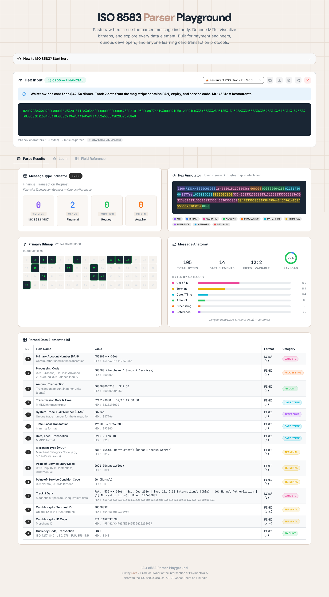

# ISO 8583 Parser Playground

> **Paste raw hex → see the parsed message instantly**

A browser-based tool for decoding ISO 8583 payment messages. Visualize MTIs, bitmaps, data elements, and card transaction flows — built for payment engineers, curious developers, and anyone learning how card transactions work under the hood.

[](https://react.dev)
[](https://typescriptlang.org)
[](https://mantine.dev)
[](https://vitejs.dev)
[](LICENSE)

---

## 🚀 [Launch Live Demo](https://siva-sub.github.io/ISO-8583-parser-playground/)

---



---

## 💡 Why I Built This

ISO 8583 is the **invisible backbone** of every card transaction — ATM withdrawals, POS purchases, refunds, reversals. Yet understanding what's inside a raw hex dump requires deep domain expertise and a lot of spec-reading.

> **"What does that hex blob actually mean?"**

| Challenge | Traditional Approach | Parser Playground |
|-----------|---------------------|-------------------|
| Decoding hex dumps | Manual byte-counting with spec PDFs | Instant visual parse |
| Understanding MTIs | Look up tables in documentation | Auto-decoded with version/class/function/origin |
| Identifying fields | Count bitmap bits by hand | Interactive bitmap visualization |
| MCC codes | Cross-reference ISO 18245 lists | 1,088 codes with industry group labels |
| Card BIN identification | Manual lookup on third-party sites | 374K BIN database with brand, issuer, country |
| Luhn validation | Write your own checker | Instant ✅/❌ badge on every PAN |
| Track 2 data | Parse separator characters manually | Auto-split PAN, expiry, service code |
| Sharing findings | Copy/paste hex + explanations | Shareable URLs with full state |

This tool pairs with my [ISO 8583 Carousel & PDF Cheat Sheet](https://www.linkedin.com/in/sivasub987/) on LinkedIn — learn the spec visually, then explore real messages here.

---

## ✨ Features

### 🔍 Deep Message Parsing
- **MTI Decoder** — Breaks down Message Type Indicator into version, class, function, and origin with human-readable descriptions (24 named types from the spec)
- **Bitmap Visualization** — Interactive 64-bit primary bitmap with active field highlighting
- **Hex Annotator** — Color-coded hex overlay showing which bytes map to which field, with category badges (Card/ID, Amount, Processing, Date/Time, etc.). Click any segment to highlight and center the corresponding field

### 📊 Message Anatomy
- **Quick Stats** — Total bytes, data element count, fixed-to-variable ratio, payload percentage
- **Bytes by Category** — Horizontal bar chart breaking down byte allocation across field categories
- **Largest Field Detection** — Highlights the most significant data element

### 🏷️ Rich Data Enrichment
- **1,088 Merchant Category Codes (MCC)** — Full ISO 18245 database with 22 industry group labels (sourced from [monobank_api](https://github.com/mamantoha/monobank_api) + [maximbilan/mcc](https://github.com/maximbilan/mcc))
- **374K BIN Database** — Instant card BIN lookup showing Brand, Type, Category, Issuer, and Country for any PAN (sourced from [Carding-Tools-Web-Version](https://github.com/walterwhite-69/Carding-Tools-Web-Version))
- **Luhn Validation** — Real-time Luhn algorithm check on DE2 (PAN) with ✅/❌ badge
- **ISO 4217 Currency Codes** — 40+ currencies with symbols and minor unit precision
- **Processing Codes** — DE3 decoded to human-readable transaction types
- **Response Codes** — DE39 mapped to approval/decline reasons
- **POS Entry Modes** — DE22 decoded (chip, contactless, mag stripe, e-commerce)
- **Track 2 Parsing** — Structured PAN, expiry, service code, and discretionary data extraction
- **PAN Masking** — Automatic first-6/last-4 masking for security

### 🎓 Learning Mode
- **"New to ISO 8583?" accordion** — Collapsible beginner guide explaining the protocol basics
- **10+ preset messages** — Real-world scenarios: ATM withdrawal, e-commerce, restaurant POS, network echo, balance inquiry, and more
- **Field Reference** — Complete 128-field specification table with names, formats, and categories
- **Learning Scenarios** — Guided walkthroughs with contextual hints

### 📤 Export & Share
- **Shareable URLs** — Hex state encoded in URL hash for instant sharing
- **JSON Download** — Export parsed results as structured `.json` files
- **Text Copy** — Copy formatted text output (moov-io describe style)

---

## 🏗 Architecture

```
┌──────────────────────────────────────────────────────────┐
│                    Browser (Client-Side Only)              │
├──────────────────────────────────────────────────────────┤
│                                                            │
│  ┌─────────────┐  ┌─────────────┐  ┌──────────────────┐  │
│  │  App.tsx     │  │  parser.ts  │  │  fieldSpecs.ts   │  │
│  │  UI + Enrich │  │  Binary     │  │  128 field defs  │  │
│  │  + Annotator │  │  Parser     │  │  + response codes│  │
│  └──────┬──────┘  └──────┬──────┘  └─────────┬────────┘  │
│         │                │                    │            │
│  ┌──────▼──────┐  ┌──────▼──────┐  ┌─────────▼────────┐  │
│  │ mccDatabase │  │  presets.ts │  │  index.css       │  │
│  │ 1,088 codes │  │  10+ sample │  │  Dark theme      │  │
│  │ ISO 18245   │  │  messages   │  │  + animations    │  │
│  └─────────────┘  └─────────────┘  └──────────────────┘  │
│                                                            │
│  No backend. No API calls. Everything runs in your browser.│
└──────────────────────────────────────────────────────────┘
```

This is a **zero-backend, client-side application**. Your hex data never leaves the browser — there are no API calls, no server processing, and no data collection.

---

## 📂 Project Structure

```
ISO-8583-parser-playground/
├── src/
│   ├── App.tsx            # Main component: UI, enrichment, BIN lookup, Luhn validator
│   ├── parser.ts          # Binary ISO 8583 parser (hex → structured result)
│   ├── fieldSpecs.ts      # 128 field definitions, processing/response codes
│   ├── mccDatabase.ts     # 1,088 MCC codes (ISO 18245) with industry groups
│   ├── presets.ts         # 10+ preset messages (ATM, POS, e-commerce, etc.)
│   ├── index.css          # Dark theme, animations, responsive styles
│   └── main.tsx           # React entry point with Mantine provider
├── public/
│   └── bin-list-data.csv  # 374K BIN entries (lazy-loaded at runtime)
├── scripts/
│   └── build-bin-data.cjs # Optional: CSV → JSON pre-processing utility
├── docs/
│   └── screenshot-hero.png
├── index.html
├── vite.config.ts
├── tsconfig.json
└── package.json
```

---

## 🛠 Local Development

### Prerequisites
- Node.js 18+
- npm or yarn

### Quick Start
```bash
git clone https://github.com/siva-sub/ISO-8583-parser-playground.git
cd ISO-8583-parser-playground
npm install
npm run dev
```

Open `http://localhost:5173/ISO-8583-parser-playground/` and paste any ISO 8583 hex dump.

### Build for Production
```bash
npm run build
```

Output goes to `dist/` — deploy to any static host (GitHub Pages, Netlify, Vercel).

---

## 🧩 Preset Messages

| Preset | MTI | Description | Key Fields |
|--------|-----|-------------|------------|
| 💳 ATM Cash Withdrawal | 0200 | Cash withdrawal at ATM | DE2, DE3, DE4, DE41, DE43 |
| 🛒 E-Commerce Purchase | 0100 | Online authorization request | DE2, POS mode 09 (e-commerce) |
| 🍝 Restaurant POS | 0200 | Mag stripe dinner purchase | DE18 (MCC 5812), DE35 (Track 2) |
| ✅ Authorization Response | 0110 | Approval with auth code | DE38, DE39 (response code) |
| 🔄 Reversal | 0420 | Transaction reversal | Original data elements |
| 📡 Network Echo | 0800 | Network management test | Minimal fields |
| 💰 Balance Inquiry | 0200 | Account balance check | DE3 (310000) |
| 🏧 ATM Response | 0210 | ATM response with balance | DE39, DE54 |
| 🌍 International Purchase | 0100 | Cross-border EUR transaction | DE49 (978=EUR) |
| ⛽ Gas Station Pre-Auth | 0100 | Fuel pump pre-authorization | DE18 (MCC 5542) |

---

## 🛡️ Data Enrichment Sources

| Data | Source | Count |
|------|--------|-------|
| BIN Database | [Carding-Tools-Web-Version](https://github.com/walterwhite-69/Carding-Tools-Web-Version) `bin-list-data.csv` | 374K BINs |
| MCC Codes | [monobank_api](https://github.com/mamantoha/monobank_api) + [maximbilan/mcc](https://github.com/maximbilan/mcc) | 1,088 codes |
| MTI Descriptions | [moov-io/iso8583](https://github.com/moov-io/iso8583) `constant.go` | 24 types |
| Field Specifications | ISO 8583:1987/1993 spec | 128 fields |
| Track 2 Parsing | [moov-io/iso8583](https://github.com/moov-io/iso8583) `field/track2.go` | Regex-based |
| Currency Codes | ISO 4217 | 40+ currencies |
| Processing Codes | ISO 8583 DE3 spec | 6 types |
| Response Codes | ISO 8583 DE39 spec | 20+ codes |

---

## 🔧 Technology Stack

| Component | Technology |
|-----------|-----------|
| **Framework** | React 19, TypeScript 5.7 |
| **UI Library** | Mantine 7.17, Tabler Icons |
| **Build Tool** | Vite 6 |
| **Styling** | CSS with dark theme, glassmorphism |
| **Deployment** | GitHub Pages (static SPA) |

---

## 📖 References

- [ISO 8583 — Wikipedia](https://en.wikipedia.org/wiki/ISO_8583)
- [moov-io/iso8583](https://github.com/moov-io/iso8583) — Go implementation (field specs, Track 2 parsing)
- [ISO 18245 MCC Database](https://github.com/mamantoha/monobank_api) — Merchant category codes
- [ISO 4217 Currency Codes](https://www.iso.org/iso-4217-currency-codes.html)

---

## Disclaimer

This is a **portfolio project / educational tool**. It parses hex dumps client-side for learning and debugging purposes. It does not connect to any payment network, process real transactions, or handle live cardholder data.

---

## 👤 About the Author

**Sivasubramanian Ramanathan**
*Product Owner | Fintech, Payments & Digital Innovation*
*Ex-BIS Innovation Hub Singapore*

Building at the intersection of payments infrastructure and AI. Open for roles in Product Management, Fintech, Payments, and Digital Assets.

[](https://www.linkedin.com/in/sivasub987)
[](https://www.sivasub.com)
[](https://github.com/siva-sub)

---

## 📄 License

MIT License © 2026 [Siva Subramanian](https://sivasub.com)

---

Built with ❤️ for the payments community.

[siva-sub.github.io/ISO-8583-parser-playground/](https://siva-sub.github.io/ISO-8583-parser-playground/)
